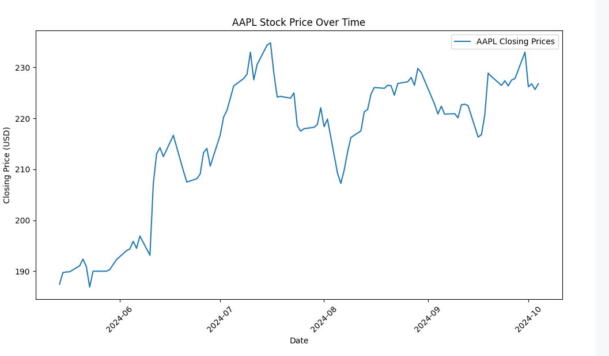

# Financial Data Pipeline

## Project Overview
This project demonstrates a simple financial data pipeline that fetches stock data from the Alpha Vantage API, processes it, and stores it into a PostgreSQL database. The pipeline is orchestrated using Apache Airflow, and the stored data is visualized using Matplotlib.

### Key Features:
- **Data Ingestion**: Fetches stock market data from Alpha Vantage API.
- **Data Transformation**: Cleans and processes the stock data.
- **Data Storage**: Stores the transformed data into a PostgreSQL database.
- **Orchestration**: Apache Airflow is used to automate the ETL (Extract, Transform, Load) process.
- **Visualization**: Stock data is visualized using Matplotlib.

## Prerequisites

- **Python 3.x**: Make sure Python is installed on your machine.
- **PostgreSQL**: A running PostgreSQL database instance.
- **Docker**: For running Apache Airflow.
- **Alpha Vantage API key**: You can get one for free by signing up [here](https://www.alphavantage.co/support/#api-key).

### Python Dependencies:
Install the required Python libraries by running:
```bash
pip install -r requirements.txt
```

## Project Structure

```bash
financial-data-pipeline/
│
├── airflow_dags/
│   └── financial_data_pipeline_dag.py    # Airflow DAG for orchestrating the data pipeline
│
├── data_fetching/
│   └── fetch_stock_data.py               # Python script to fetch and store stock data
│
├── sql/
│   └── create_stock_data_table.sql       # SQL script for creating PostgreSQL table
│
├── visualization/
│   └── visualize_stock_data.py           # Python script to visualize stock data using Matplotlib
│
├── requirements.txt                      # Python dependencies
│
├── docker-compose.yaml                   # Docker Compose configuration for Apache Airflow
│
└── README.md                             # Project documentation (this file)
```

## Setup Instructions

### Step 1: PostgreSQL Setup
1. **Install PostgreSQL**: Make sure PostgreSQL is installed and running on your machine.
2. **Create the Database**:
   - Log into PostgreSQL using the following command:
     ```bash
     psql -U postgres
     ```
   - Create the `financial_data` database:
     ```sql
     CREATE DATABASE financial_data;
     ```
   - Create the table by running the SQL script:
     ```bash
     psql -U postgres -d financial_data -f sql/create_stock_data_table.sql
     ```

### Step 2: Setting up Airflow with Docker
1. **Download the Docker Compose YAML**:
   - Make sure `docker-compose.yaml` is in your project directory.
   
2. **Set Environment Variables**:
   - Create a `.env` file with the following content:
     ```bash
     AIRFLOW_UID=50000
     AIRFLOW_GID=0
     ```

3. **Run the Airflow Services**:
   - Start Airflow by running:
     ```bash
     docker-compose up
     ```

   - Once all services are up, access the Airflow UI at `http://localhost:8081`. Use the default credentials:
     ```
     Username: airflow
     Password: airflow
     ```

4. **Add DAGs**:
   - Place your DAG files in the `airflow_dags/` directory to orchestrate the pipeline. Airflow will automatically detect the DAGs.

### Step 3: Fetch and Store Stock Data

1. **Update API Key**:
   - In `fetch_stock_data.py`, add your Alpha Vantage API key:
     ```python
     API_KEY = 'your_alpha_vantage_api_key'
     ```

2. **Run the Script**:
   - Execute the data fetching script to load stock data into PostgreSQL:
     ```bash
     python data_fetching/fetch_stock_data.py
     ```

### Step 4: Visualization

1. **Run Visualization Script**:
   - After data is stored in PostgreSQL, you can visualize the stock data by running the following command:
     ```bash
     python visualization/visualize_stock_data.py
     ```
   - A plot will be displayed showing the stock's closing prices over time.
   - 

## Airflow DAG Setup

1. **DAG Definition**:
   - The `financial_data_pipeline_dag.py` DAG orchestrates the data fetching and storing processes using Airflow. The DAG is scheduled to run daily:
   ```python
   dag = DAG(
       'financial_data_pipeline',
       default_args=default_args,
       description='A simple financial data ETL pipeline',
       schedule=timedelta(days=1),
   )
   ```

2. **Airflow Tasks**:
   - The `fetch_and_store` function fetches stock data and stores it into the database:
   ```python
   def fetch_and_store():
       symbol = 'AAPL'
       stock_data_df = fetch_stock_data.fetch_stock_data(symbol)
       fetch_stock_data.store_data_to_postgresql(stock_data_df)
   ```

   - Airflow will automatically trigger this task based on the schedule you define in the DAG.

## Troubleshooting

- **Port Conflict**: If you encounter a port conflict when starting Airflow, make sure port `8080` is not in use or update the port in `docker-compose.yaml`:
  ```yaml
  ports:
    - "8081:8080"
  ```

- **Database Connection Issues**: Ensure that PostgreSQL is running and the correct credentials are provided in the connection string.

## Future Improvements

- Add more complex transformations or calculations on the stock data.
- Extend the pipeline to handle multiple stock symbols and automatically fetch and store data for each.
- Integrate Looker (or another BI tool) for advanced data visualization.
